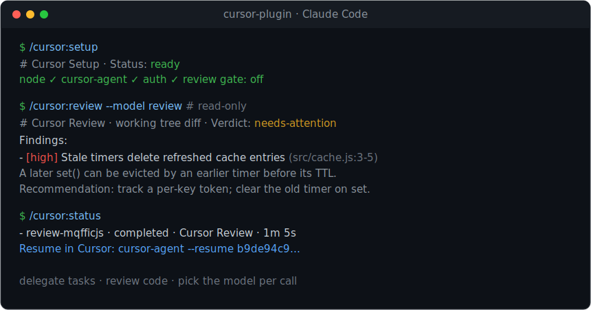

<div align="center">

# cursor-plugin

### Run [Cursor](https://cursor.com)'s `cursor-agent` from inside **Claude Code**

Delegate tasks · rescue stuck work · review code — on the model you pick, **per call**.

[](https://github.com/Armert-Labs/cursor-plugin/actions/workflows/ci.yml)
[](./LICENSE)


[](#quick-start)


<a href="#quick-start"><b>Quick start</b></a> ·
<a href="#commands"><b>Commands</b></a> ·
<a href="#models"><b>Models</b></a> ·
<a href="#how-it-works"><b>How it works</b></a> ·
<a href="./examples/README.md"><b>Examples</b></a>

</div>

---

> [!NOTE]
> Unofficial community plugin by [Armert Labs](https://github.com/Armert-Labs). Not affiliated with Anysphere (Cursor) or Anthropic.

It mirrors the command surface of OpenAI's [`codex-plugin-cc`](https://github.com/openai/codex-plugin-cc) but targets Cursor. Because `cursor-agent` exposes a simple headless interface (`-p --output-format json`), there's no app-server or broker — the plugin just shells out to `cursor-agent` and parses its output.

## ✨ Features

|   | |
| --- | --- |
| 🧠 **Any model, per call** | Pick `composer`, `gpt-5.x`, `claude-opus`… on every command. No hardcoded default. |
| ✍️ **Write or read-only** | `/cursor:rescue` edits files by default; `--read-only` analyzes without touching them. |
| 🔍 **Structured reviews** | `/cursor:review` returns severity-sorted findings with `file:line` and concrete fixes. |
| ⏱️ **Background jobs** | Fire-and-forget with `--background`, then `status` / `result` / `cancel`. |
| ↩️ **Resumable** | Every run yields a Cursor chat id you can pick back up. |
| 🛡️ **Optional stop-gate** | Have Cursor sign off on the last turn before a session ends. |
| 👥 **Team orchestration** | Send different tasks to different models, in parallel. |
| 📦 **Zero dependencies** | Pure Node built-ins · hermetic tests · nothing fetched at runtime. |

<a id="quick-start"></a>

## 🚀 Quick start

> [!TIP]
> This repo **is** the marketplace — install works immediately, with **no directory approval and no fee**.

Inside Claude Code:

```text
/plugin marketplace add Armert-Labs/cursor-plugin   # 1 · add this repo as a marketplace
/plugin install cursor@cursor-plugin                # 2 · install the plugin
/cursor:setup                                       # 3 · verify cursor-agent is ready
```

Then `/cursor:review` to review your changes, or `/cursor:rescue <task>` to delegate work to Cursor. You'll need an installed, authenticated `cursor-agent` first — the [full setup](#installation) takes about a minute.

## 🎬 See it in action

The animated demo at the top is a **real** `/cursor:review`. Here's the same kind of session, frozen for a quick read:

<p align="center"></p>

<details>
<summary><b>The same session as copyable text</b></summary>

```console
> /cursor:setup
# Cursor Setup
Status: ready
Checks:
- node: v24.12.0
- cursor-agent: 2026.06.15-...
- auth: logged in as you@example.com
- session runtime: direct
- review gate: disabled

> /cursor:rescue --read-only --model max  what does src/cache.js do and what's the risk?
src/cache.js adds a process-local in-memory Map cache with get() and set() helpers,
where set() schedules deletion after ttlMs. The main risk is unbounded,
non-tenant-aware, per-process caching that can leak or mix sensitive data across
tenants and break consistency across horizontally scaled instances.

> /cursor:review
# Cursor Review
Target: working tree diff
Verdict: needs-attention

TTL support via bare setTimeout introduces a stale-timer eviction race on key
refresh and breaks prior two-argument set() semantics by scheduling immediate
deletion when ttlMs is omitted or invalid.

Findings:
- [high] Stale timers delete refreshed cache entries (src/cache.js:3-5)
  Each set() call schedules an independent setTimeout that unconditionally runs
  store.delete(key). If the same key is written again before an earlier timer
  fires, the obsolete timer still deletes the newer value before its TTL expires.
  Recommendation: track a per-key timer handle or generation token; clear the
  previous timer on set, and delete only if the token still matches.

> /cursor:status
# Cursor Status
Latest finished:
- review-mqfficjs | completed | review | Cursor Review
  Phase: done   Duration: 1m 5s
  Cursor chat ID: b9de94c9-f185-4044-9f28-242570bc9d43
  Resume in Cursor: cursor-agent --resume b9de94c9-f185-4044-9f28-242570bc9d43
```

</details>

## 💡 Why this plugin

Claude Code is great, but sometimes you want a **second agent** on the job:

- a **cheaper/faster** model to grind through routine edits while Claude does the thinking,
- a **different model family** for a fresh perspective or a tie-breaker review,
- a **parallel teammate** so two pieces of work happen at once,
- or a steerable **code reviewer** that never touches your files.

`cursor-plugin` lets Claude hand any of these off to Cursor's `cursor-agent` and bring the result back inline — and you pick the model on every call.

## 📋 Requirements

| Requirement | Notes |
| --- | --- |
| **Node.js ≥ 18.18** | The plugin's runtime is plain Node ESM with **zero dependencies**. |
| **git** | Reviews operate on your repository's git state. |
| **Cursor CLI (`cursor-agent`)** | Installed and authenticated (steps below). |
| **A Cursor account** | Any tier works (including free). Usage is billed against your Cursor plan. |

<a id="installation"></a>

## 📦 Installation

### 1 · Install the Cursor CLI

**macOS / Linux:**

```bash
curl https://cursor.com/install -fsS | bash
```

This installs `cursor-agent` (typically to `~/.local/bin`). Restart your shell or ensure that directory is on your `PATH`, then confirm:

```bash
cursor-agent --version    # e.g. 2026.06.15-...
```

**Windows:** follow the official instructions at <https://cursor.com/docs/cli>. The plugin runs `cursor-agent` without a shell for safety, so `cursor-agent` must be directly invokable on your `PATH` (WSL is the smoothest path on Windows).

### 2 · Authenticate the Cursor CLI

```bash
cursor-agent login        # opens a browser; recommended for local use
cursor-agent status       # → ✓ Logged in as you@example.com
```

For headless / CI use (no browser), set an API key instead: `export CURSOR_API_KEY="…"` (from the Cursor dashboard).

### 3 · Add the marketplace & install the plugin

This plugin is distributed through its **own self-hosted marketplace** — this very GitHub repo. That's a first-class Claude Code distribution method: it works immediately, needs **no Anthropic directory approval**, and you keep control of versions. (Claude Code can add any git repo whose root contains a `.claude-plugin/marketplace.json`.)

```text
/plugin marketplace add Armert-Labs/cursor-plugin
/plugin install cursor@cursor-plugin
```

- `marketplace add` registers this repo as a plugin source (Claude Code reads `.claude-plugin/marketplace.json` at the root).
- `install cursor@cursor-plugin` installs the `cursor` plugin from the `cursor-plugin` marketplace.
- **Reload when prompted** (or restart Claude Code) so the new slash commands, the `cursor:cursor-rescue` agent, and the hooks load.

**Verify it loaded:** open `/plugin` and you'll see **cursor** under *Installed*, or run `/help` and look for the `/cursor:*` commands.

> [!NOTE]
> **Local development install** — point the marketplace at a checkout instead of GitHub:
> ```text
> /plugin marketplace add /absolute/path/to/cursor-plugin
> /plugin install cursor@cursor-plugin
> ```

### 4 · Run setup & verify

```text
/cursor:setup
```

`/cursor:setup` prints a readiness report and tells you exactly what (if anything) is missing — and it never installs or logs in *for* you:

```text
# Cursor Setup
Status: ready
Checks:
- node: v24.12.0
- cursor-agent: 2026.06.15-...
- auth: logged in as you@example.com
- session runtime: direct
- review gate: disabled
```

You're ready. Try `/cursor:rescue --read-only summarize what this repo does`.

### Updating & uninstalling

```text
/plugin marketplace update cursor-plugin     # pull the latest version
/plugin uninstall cursor@cursor-plugin       # remove the plugin
```

<a id="commands"></a>

## 🧩 Commands

All commands are namespaced under `/cursor:`. They're thin wrappers around a bundled `cursor-companion.mjs` script you never call directly.

### `/cursor:setup` — check the toolchain & toggle the review gate

```text
/cursor:setup
/cursor:setup --enable-review-gate
/cursor:setup --disable-review-gate
```

| Flag | Effect |
| --- | --- |
| *(none)* | Print the readiness report (node, cursor-agent, auth, review-gate state). |
| `--enable-review-gate` | Turn on the [stop-time review gate](#stop-time-review-gate) for this repo. |
| `--disable-review-gate` | Turn it off again. |

The gate setting is **per repository** and persisted on disk.

### `/cursor:rescue` — delegate a task to Cursor

The main "do something" command: investigate a bug, implement a change, or continue earlier work. It runs through a thin forwarding subagent (`cursor:cursor-rescue`) and returns Cursor's output verbatim.

```text
/cursor:rescue <what Cursor should do>
/cursor:rescue --read-only investigate why the auth test is flaky
/cursor:rescue --model spark rename getUser to fetchUser across the repo
/cursor:rescue --background --model max implement the retry logic in src/queue.ts
/cursor:rescue --resume keep going
```

| Flag | Default | Meaning |
| --- | --- | --- |
| *(positional text)* | — | The task, in natural language. |
| `--read-only` | off | Analysis only — Cursor reads and answers but **does not edit** (`cursor-agent --mode ask`). |
| *(no `--read-only`)* | **on** | **Write-capable** — Cursor may edit files in the working tree (`cursor-agent --force`). |
| `--model <model\|alias>` | account default | Route this task to a specific [model](#models). |
| `--background` / `--wait` | `--wait` | Run detached (Claude keeps working) or in the foreground (Claude waits). |
| `--resume` / `--fresh` | ask | Continue the latest Cursor chat in this repo, or start a fresh one. |

> [!IMPORTANT]
> Rescue is **write-capable by default** — it can edit your working tree. Add `--read-only` when you only want analysis. The `cursor:cursor-rescue` subagent is also used **proactively**: when Claude is stuck, it can delegate to Cursor on its own.

### `/cursor:review` — structured, read-only code review

A severity-sorted review of your current git changes with `file:line` references. Cursor never edits anything here.

```text
/cursor:review
/cursor:review --base main
/cursor:review --scope working-tree
/cursor:review --background --model review
```

| Flag | Default | Meaning |
| --- | --- | --- |
| `--base <ref>` | auto | Review the diff against a base branch/ref (e.g. `main`). |
| `--scope auto\|working-tree\|branch` | `auto` | What to review. `auto` = uncommitted changes if dirty, else branch diff. |
| `--model <model\|alias>` | account default | Model to review with (e.g. `--model review`). |
| `--wait` / `--background` | asks | Foreground, or detached as a background job. |

If you don't pass `--wait`/`--background`, Claude estimates the change size and asks which to use.

### `/cursor:adversarial-review` — challenge the approach

Like `/cursor:review`, but framed to **challenge** the design — choices, assumptions, tradeoffs, failure modes — not just surface defects. Also **read-only**. Unlike `/cursor:review`, it accepts optional **focus text**.

```text
/cursor:adversarial-review
/cursor:adversarial-review focus on the retry and idempotency logic
/cursor:adversarial-review --base main --model review challenge the caching design
```

Same flags as `/cursor:review`, plus trailing free-text focus.

### `/cursor:status` · `/cursor:result` · `/cursor:cancel` — manage jobs

```text
/cursor:status                 # compact table of this session's jobs
/cursor:status <job-id> --wait # block until a job finishes
/cursor:result [job-id]        # the stored output of a finished job
/cursor:cancel [job-id]        # stop an active background job
```

- **`status`** rows show kind (rescue/review/adversarial-review), status, phase, elapsed time, the **Cursor chat id**, and follow-up commands. `--all` includes older jobs; `--timeout-ms` caps `--wait`.
- **`result`** prints the full output (review findings or rescue answer), token usage, the chat id, and a `cursor-agent --resume <chatId>` hint.
- **`cancel`** signals the detached worker's process group; a concurrent finish won't overwrite a cancellation.

<a id="models"></a>

## 🧠 Models

There is **no hardcoded default model**. When you omit `--model`, `cursor-agent` uses your account's configured default. Otherwise pick per call. Aliases are conveniences; **any** concrete `cursor-agent` model id also works (`cursor-agent --list-models` lists them).

| Alias | Resolves to | Best for |
| --- | --- | --- |
| `spark` / `composer` | `composer-2.5` | Fast, cheap routine rescue |
| `fast` | `composer-2.5-fast` | Quick edits |
| `review` / `codex` | `gpt-5.1-codex-max-high` | Code review, deep/hard work |
| `max` | `gpt-5.5-high` | Demanding implementation tasks |
| `opus` | `claude-opus-4-8-high` | A second opinion from a different model family |

```text
/cursor:review --model review                  # strong reviewer
/cursor:rescue --model spark fix the lint errors # cheap & fast
/cursor:rescue --model some-exact-model-id do X  # any cursor-agent model id
```

The model that actually ran is reported back (in `/cursor:result` and `/cursor:status`), so you always know what produced an answer.

## 🔀 Foreground vs background jobs

- **Foreground** (`--wait`, the rescue default): Claude waits and returns the result in the same turn. Best for short tasks — `cursor-agent` has noticeable startup latency, so long tasks are better backgrounded.
- **Background** (`--background`): the task runs in a detached worker. Claude keeps working; you track it with `/cursor:status`, fetch it with `/cursor:result`, and stop it with `/cursor:cancel`. Progress streams to a per-job log.

## ↩️ Resuming work

Every Cursor run returns a **chat id** (`session_id`), stored so you can continue the same conversation:

- `/cursor:rescue --resume keep going` continues the latest rescue chat in this repo.
- `/cursor:result` prints `cursor-agent --resume <chatId>` to continue inside Cursor directly.

Resume candidates are scoped to your current Claude session.

<a id="stop-time-review-gate"></a>

## 🛡️ The stop-time review gate

An **optional** safety net. When enabled (`/cursor:setup --enable-review-gate`), Claude runs a quick **read-only** Cursor review of the *previous* turn before the session is allowed to stop:

- `ALLOW: …` → the session stops normally.
- `BLOCK: <reason>` → Claude is told to keep working and fix it first.

It only reviews turns that actually changed code, and it can never edit anything. **Disabled by default.**

## 👥 Team orchestration (multi-model)

Because the model is chosen per call, you can run a **team**: dispatch one task to Composer and another to a stronger model in parallel, then review with a third.

```text
/cursor:rescue --background --model spark  implement slugify(str) in slug.js
/cursor:rescue --background --model max     implement truncate(str, n) in truncate.js
/cursor:status                              # watch both run at once
/cursor:review --model review               # review the combined result, read-only
```

A runnable orchestrator and a full walkthrough (including a cross-tool team with OpenAI Codex) live in **[`examples/`](./examples/README.md)**.

> [!WARNING]
> Two write-capable jobs editing the **same** files at once will clobber each other. Give each parallel writer its own files, or keep all-but-one read-only.

<a id="how-it-works"></a>

## ⚙️ How it works

```text
You ──/cursor:rescue──▶ cursor:cursor-rescue  (subagent · thin forwarder)
                              │  one Bash call
                              ▼
                    cursor-companion.mjs       (dispatcher)
                              │  spawn · parse json / stream-json
                              ▼
                         cursor-agent  -p --output-format json --trust …
```

- **Commands** are thin: they shell out to the companion and return its output.
- **`cursor:cursor-rescue`** makes exactly one call and returns Cursor's output verbatim — no second-guessing, no hidden edits.
- **`cursor-companion.mjs`** builds the `cursor-agent` argv, runs it, parses the result (`json` for one-shot, `stream-json` for live progress), tracks jobs, and renders output.
- **Reviews** collect a git-diff context and ask Cursor for structured JSON, validated and rendered by severity.

<details>
<summary><b>Repository layout</b></summary>

```text
plugins/cursor/
  commands/      slash commands (setup, rescue, review, adversarial-review, status, result, cancel)
  agents/        cursor-rescue — the forwarding subagent
  skills/        internal contracts (runtime, result handling, prompting)
  hooks/         session lifecycle + optional stop-time review gate
  prompts/       review / adversarial / stop-gate templates
  schemas/       structured review-output JSON schema
  scripts/
    cursor-companion.mjs   the dispatcher
    lib/cursor.mjs         spawns cursor-agent, parses output
    lib/*.mjs              args, git, state, job tracking, rendering
examples/        runnable orchestration examples
tests/           hermetic node --test suite (fake cursor-agent)
```

</details>

## 🗂️ Where state is stored

Per-workspace job records, logs, and the review-gate setting live under:

```text
~/.claude/cursor-companion/workspaces/<repo-slug>-<hash>/
  state.json          # config + job list
  jobs/<id>.json      # per-job record (incl. chat id, result)
  jobs/<id>.log       # streamed progress
```

When run inside Claude Code, the plugin uses its provided data directory instead. State is **per repository**; jobs are scoped to your Claude session.

## 🩺 Troubleshooting

| Symptom | Fix |
| --- | --- |
| `/cursor:*` commands don't appear | Finish `/plugin install cursor@cursor-plugin` and reload/restart Claude Code. |
| Setup says cursor-agent is missing | Install it (step 1) and ensure it's on your `PATH` (`cursor-agent --version`). |
| `cursor-agent` crashes on launch / macOS "could not verify… / Move to Trash" | The binary is quarantined (common with the Homebrew cask). Prefer the official installer (step 1), which installs unquarantined; or clear it: `xattr -dr com.apple.quarantine <path>`, or `brew reinstall --cask --no-quarantine cursor-cli`. The CLI is validly signed — only the quarantine flag triggers the block. |
| Wrong/duplicate `cursor-agent` picked from `PATH` | Point the plugin at the right binary: `export CURSOR_AGENT_BIN="$HOME/.local/bin/agent"` (an absolute path, or a bare command name resolved on `PATH`). |
| Setup says not authenticated | Run `cursor-agent login`, or set `CURSOR_API_KEY`. |
| "Workspace Trust Required" / hard fail | The plugin always passes `--trust`; if you see this you're likely calling `cursor-agent` yourself without it. |
| A review returns no JSON / parse error | Output is shown raw with the parse error. Re-run, or try `--model review` for a stronger model. |
| A background job is stuck | `/cursor:status <id>` to inspect, `/cursor:cancel <id>` to stop it. |
| Windows issues | Best-effort only; use WSL and ensure `cursor-agent` is directly on `PATH`. |

## 🔒 Security & safety

- **No shell interpolation.** `cursor-agent` is never spawned through a shell, so prompt text can't be interpreted as shell commands (injection-safe).
- **Read-only really is read-only.** Reviews and `--read-only` rescues use `cursor-agent --mode ask`; Cursor reads and answers but cannot edit.
- **Write tasks edit your files.** A default (write-capable) rescue can modify the working tree — review the diff afterward, especially for background jobs.
- **Cost.** Stronger models cost more than `composer-2.5`; token usage is surfaced in `/cursor:result` and `/cursor:status`.

See [SECURITY.md](./SECURITY.md) to report a vulnerability.

## 🧪 Development

```bash
npm test    # node --test — hermetic, uses a fake cursor-agent (no credits spent)
```

Zero runtime dependencies — only Node.js built-ins. Contributions welcome; see [CONTRIBUTING.md](./CONTRIBUTING.md) and our [Code of Conduct](./CODE_OF_CONDUCT.md).

## 📄 License

[MIT](./LICENSE) © [Armert Labs](https://github.com/Armert-Labs)

---

<div align="center"><sub>Built with care by <a href="https://github.com/Armert-Labs">Armert Labs</a> · <a href="./CONTRIBUTING.md">Contribute</a> · <a href="https://github.com/Armert-Labs/cursor-plugin/issues">Issues</a></sub></div>
